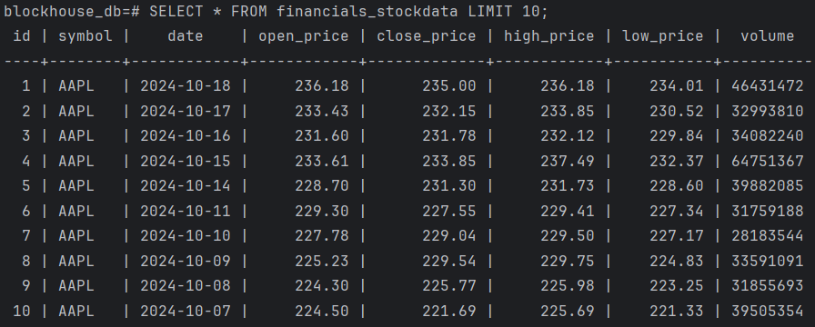

## Step 1: Fetch Financial Data

1. Configure Django to Connect to My PostgreSQL Database:

   Open `settings.py`. Under the `DATABASES` section, set up my PostgreSQL connection.

2. Activate virtual environment:

   ```bash
   python -m venv venv
   venv/Scripts/activate
   ```

3. **Install PostgreSQL Adapter for Python**:

   ```bash
   pip install psycopg2
   ```

4. **Run Migrations**:

   ```bash
   pip install Django
   python manage.py makemigrations
   python manage.py migrate
   ```

5. **Create a Django App**:

   ```bash
   python manage.py startapp financials
   ```

   Add the App to `INSTALLED_APPS` in `settings.py`.

6. **Define My Model in `models.py`**

   Open the `models.py` file and add codes.

7. **Run Migrations**:

   ```bash
   python manage.py makemigrations
   python manage.py migrate
   ```

8. **Install Requests Library**

   ```bash
   pip install requests
   ```

9. **Create a Django Management Command to Fetch Data**

   ```bash
   mkdir -p financials/management/commands
   ```

   Create the file `financials/management/commands/fetch_stock_data.py`

10. **Run the Command**

    ```bash
    python manage.py fetch_stock_data
    ```

11. **Verify the Data in PostgreSQL**

    ```bash
    psql -U postgres -d blockhouse_db
    ```

    ```sql
    SELECT * FROM financials_stockdata LIMIT 10;
    ```

    The output:

    

12. **Create the View in `views.py`**

13. **Add URL for the View In `urls.py` file**

14. **Access the View**

    ```bash
    python manage.py runserver
    ```

    Can trigger the data fetch by visiting http://127.0.0.1:8000/fetch-data/AAPL/

    This will initiate the process, fetch the data for `AAPL`, and store it in my database. Will receive a JSON response with the status of the operation.

15. **Update the `fetch_financial_data` view to include error handling**

    If the request fails (due to rate limits or network issues), it retries a few times.

    If a rate limit error occurs (`429` status code), it waits for 60 seconds before retrying.

    If the fetch fails after multiple retries, a clear error message is returned.

## Step 2: Backtesting Module

1. **Create the Django View or API Endpoint**

   - Create the View in `views.py`: We’ll accept parameters for initial investment, buy/sell moving averages, and the stock symbol.
   - Add URL for the View: In `urls.py`, add a URL route for the backtesting view.
   - This will allow users to access the backtesting endpoint via: http://127.0.0.1:8000/backtest/AAPL/?initial_investment=10000&buy_moving_average=50&sell_moving_average=200

2. **Write the Backtesting Logic**

   We will implement a simple strategy where:

   - **Buy** when the stock price is below the 50-day moving average.
   - **Sell** when the stock price is above the 200-day moving average.

   This logic will calculate the return on investment (ROI) and track the number of trades.

   Create the Backtesting Function: Add this function in `views.py`

   The output (http://127.0.0.1:8000/backtest/AAPL/?initial_investment=10000&buy_moving_average=50&sell_moving_average=200):

   ```json
   {"initial_investment": 10000.0, "final_value": 32712.649999999958, "total_return": 227.12649999999957, "number_of_trades": 952, "max_drawdown": 77.87827161475617}
   ```

3. **Generate Performance Summary**

   As seen in the `run_backtest` function, the performance summary will include:

   - **Initial Investment**: The amount the user started with.
   - **Final Value**: The value of the portfolio at the end of the backtest.
   - **Total Return**: The percentage gain or loss over the investment period.
   - **Number of Trades**: How many buy/sell operations were performed.
   - **Max Drawdown**: The largest peak-to-trough loss during the period (in percentage).

   This summary is returned as a JSON response from the Django view.

4. **Create Test Cases**

   To ensure the correctness of the backtesting logic, can write test cases using Django's built-in test framework.

   - Create Tests in `tests.py`
   - `python manage.py test` to run the test.

## Step 3: Machine Learning Integration

1. **Pre-Trained Model Integration**:

   - Save the Pre-Trained Model

     ```bash
     pip install scikit-learn joblib
     ```

     Load historical data from the `StockData` table and use it to train the model. Save it using `joblib`.

   - Define the `StockPrediction` Model

     In `models.py`, add codes to store the stock price predictions.

     After defining the model, create and apply migrations to update the database with the new table.

     ```bash
     python manage.py makemigrations
     python manage.py migrate
     ```

   - Load the Pre-Trained Model in Django:

2. **Create the Django API Endpoint:**

   - Add a view to load the pre-trained model and make predictions.

   - Add the API Route in `urls.py`
   - Testing the Endpoint: http://127.0.0.1:8000/predict/AAPL/

   The Output: 

   ```json
   {"predictions": [{"date": "2024-10-19", "predicted_price": 365.25019388267424}, {"date": "2024-10-20", "predicted_price": 365.3022063297576}, {"date": "2024-10-21", "predicted_price": 365.35421877684087}, {"date": "2024-10-22", "predicted_price": 365.40623122392424}, {"date": "2024-10-23", "predicted_price": 365.4582436710075}, {"date": "2024-10-24", "predicted_price": 365.51025611809087}, {"date": "2024-10-25", "predicted_price": 365.56226856517424}, {"date": "2024-10-26", "predicted_price": 365.6142810122575}, {"date": "2024-10-27", "predicted_price": 365.66629345934086}, {"date": "2024-10-28", "predicted_price": 365.7183059064241}, {"date": "2024-10-29", "predicted_price": 365.7703183535075}, {"date": "2024-10-30", "predicted_price": 365.82233080059075}, {"date": "2024-10-31", "predicted_price": 365.8743432476741}, {"date": "2024-11-01", "predicted_price": 365.9263556947575}, {"date": "2024-11-02", "predicted_price": 365.97836814184075}, {"date": "2024-11-03", "predicted_price": 366.0303805889241}, {"date": "2024-11-04", "predicted_price": 366.0823930360074}, {"date": "2024-11-05", "predicted_price": 366.13440548309075}, {"date": "2024-11-06", "predicted_price": 366.1864179301741}, {"date": "2024-11-07", "predicted_price": 366.2384303772574}, {"date": "2024-11-08", "predicted_price": 366.29044282434074}, {"date": "2024-11-09", "predicted_price": 366.342455271424}, {"date": "2024-11-10", "predicted_price": 366.39446771850737}, {"date": "2024-11-11", "predicted_price": 366.44648016559063}, {"date": "2024-11-12", "predicted_price": 366.498492612674}, {"date": "2024-11-13", "predicted_price": 366.55050505975737}, {"date": "2024-11-14", "predicted_price": 366.6025175068406}, {"date": "2024-11-15", "predicted_price": 366.654529953924}, {"date": "2024-11-16", "predicted_price": 366.70654240100725}, {"date": "2024-11-17", "predicted_price": 366.7585548480906}]}
   ```

## Step 4: Report Generation

Add some functions in `views.py`.

1. Generate the Visualization

   Use `Matplotlib` to generate the charts.

2. Generate a PDF Report

   Use `ReportLab ` 

3. Return a JSON Response

Access the PDF report via: http://127.0.0.1:8000/report/AAPL/pdf/
Access the JSON report via: http://127.0.0.1:8000/report/AAPL/json/
Access the image chart via: http://127.0.0.1:8000/report/AAPL/image/

## Step5: Deployment

1. Create a `Dockerfile`

2. Create a `docker-compose.yml`

3. Create a `.env` 

4. Build and run the Docker containers:

   Create the `requirements.txt` File

   ```bash
   pip freeze > requirements.txt
   ```

   Build and run the Docker containers

   ```bash
   docker-compose build
   docker-compose up
   ```

5. Create an RDS Instance

   Go to the AWS RDS Console and create a PostgreSQL instance.

   The Endpoint:

   ```
   blockhouse-db.c1422osiat8p.us-east-2.rds.amazonaws.com
   ```

   Master username: postgres

   ```bash
   psql -h blockhouse-db.c1422osiat8p.us-east-2.rds.amazonaws.com -U postgres
   ```

   ```bash
   python manage.py migrate
   python manage.py runserver
   ```

6. Set Up CI/CD Pipeline with GitHub Actions

   Launch a New EC2 Instance (`blockhouse-deploy`)

   - Name: blockhouse-deploy
   - Public IPv4 address: 3.137.195.47
   - Key name: EC2_SSH_KEY.pem

   Connect to EC2 instance through WSL

   ```bash
   cd /mnt/c/PycharmProjects/blockhouse
   mv EC2_SSH_KEY.pem ~/
   chmod 400 ~/EC2_SSH_KEY.pem
   ssh -i ~/EC2_SSH_KEY.pem ubuntu@3.137.195.47
   # Update EC2 Instance
   sudo apt update && sudo apt upgrade -y
   # Install Python 3 and Pip
   sudo apt install python3-pip python3-dev python3-venv -y
   # Install virtualenv
   sudo apt install python3 python3-venv
   # Clone my project from GitHub
   git clone https://github.com/muyangli2855/blockhouse.git
   cd your_repository
   # Set Up the Virtual Environment
   python3 -m venv venv
   # Activate the virtual environment
   source venv/bin/activate
   # Install my project’s dependencies
   pip install -r requirements.txt
   # Install PostgreSQL
   sudo apt install postgresql postgresql-contrib -y
   ```

   Create a `.github/workflows/deploy.yml` file.

   Configure Gunicorn and Nginx

   ```bash
   # Install Gunicorn
   pip install gunicorn
   # Test Gunicorn
   gunicorn --workers 3 blockhouse.wsgi:application
   # Install and Configure Nginx
   sudo apt install nginx -y
   # Create an Nginx Configuration for Django
   sudo nano /etc/nginx/sites-available/blockhouse
   ```

   Add configuration

   ```
   server {
       listen 80;
       server_name 3.137.195.47;
   
       location / {
           proxy_pass http://127.0.0.1:8000;
           proxy_set_header Host $host;
           proxy_set_header X-Real-IP $remote_addr;
           proxy_set_header X-Forwarded-For $proxy_add_x_forwarded_for;
           proxy_set_header X-Forwarded-Proto $scheme;
       }
   
       location /static/ {
           alias /home/ubuntu/blockhouse/static/;
       }
   
       location /media/ {
           alias /home/ubuntu/blockhouse/media/;
       }
   }
   
   ```

   Enable the Nginx Configuration

   ```
   sudo ln -s /etc/nginx/sites-available/blockhouse/etc/nginx/sites-enabled
   sudo rm /etc/nginx/sites-enabled/default
   sudo systemctl restart nginx
   ```

   